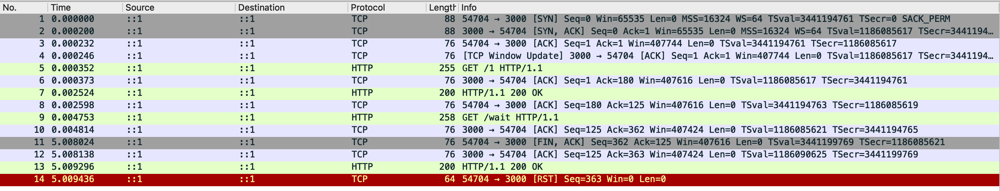

# Bug Summary: Axios Connection Pooling Misconception

## Issue
Axios relies on nodes HTTP/HTTPS agent for connection pooling rather than implementing its own. Consequently,
Axios "instances" are not truly isolated; they serve primarily to set default configurations for HTTP requests. This
misunderstanding leads to unexpected behavior when different timeouts are set for requests on what is assumed to be
isolated instances.

## Trace Analysis
The TCP trace shows that with HTTP keep-alive, requests `GET /1` and `GET /wait` are transmitted
over a single TCP connection. The initial request is configured with a 1-second timeout, followed by a request with
no timeout. The re-use of the connection for both requests causes the second request to be prematurely terminated
at the 1-second mark, despite the server still processing the request.

## Recommendation
Utilise a consistent Axios instance for all requests to a specific server. This instance should be
defined once, preferably at the module level, to avoid the repeated instantiation of Axios instances that can lead to 
unexpected timeouts due to shared underlying connections.